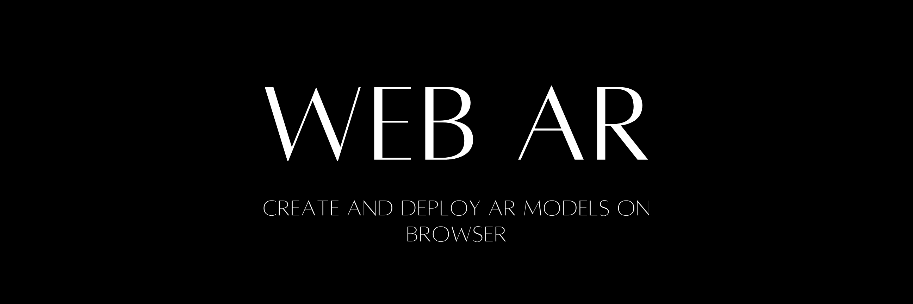

# Web AR: Displaying 3D Models on your browser


Web AR Repository allows you to render your 3D GLB/USDZ models straight in your browser. To render your own models, follow the steps-

1. Fork/Clone this repository.
2. Upload your .glb or .usdz model in your GitHub repo.
3. In index.html file, on line 12, you will notice the following lines-
```
<model-viewer src="Astronaut.glb"                  
ios-src="Astronaut.usdz"
```
4. Replace Astronaut.glb / Astronaut.usdz with the name of your own .glb / .usdz model.
5. Publish your website on GitHub Pages. To view the GitHub page for this repository, [click here](https://lightlessdays.github.io/web-ar).

For a detailed tutorial, [click here](https://lightlessdays.medium.com/how-to-create-and-deploy-your-own-webar-within-5-minutes-4aa2e0278b81?source=friends_link&sk=dc2bd6b438496a9cc38e6b9d95656083).
